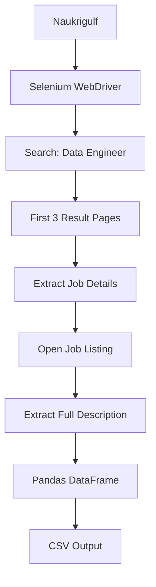

# Naukrigulf Data Engineer Job Scraper

A Python-based web scraping project that uses Selenium to collect Data Engineer job listings from Naukrigulf and save the extracted data into a structured CSV file.

## Project Overview

This project was developed as an educational Selenium web scraping project.

The scraper searches for **Data Engineer** job listings, collects jobs from the first three result pages, opens each job listing, extracts the full job description, and stores the final dataset in a CSV file.

## Workflow



## Features

- Search for Data Engineer jobs
- Scrape the first three result pages
- Extract job information
- Open individual job listings
- Extract full job descriptions
- Store the collected data in a Pandas DataFrame
- Export the final dataset to CSV

## Data Collected

| Field | Description |
|---|---|
| `job_title` | Job title |
| `company` | Company name |
| `location` | Job location |
| `experience` | Required experience |
| `job_url` | Job listing URL |
| `description` | Full job description |

## Technologies Used

- Python
- Selenium
- Undetected ChromeDriver
- Pandas
- Google Chrome

## Project Structure

```text
naukrigulf-data-engineer-scraper/
├── scraper.py
├── naukrigulf_data_engineer.csv
├── requirements.txt
├── README.md
└── .gitignore
```

## Installation

Clone the repository:

```bash
git clone <your-repository-url>
```

Navigate to the project directory:

```bash
cd naukrigulf-data-engineer-scraper
```

Install the required packages:

```bash
pip install -r requirements.txt
```

## How to Run

Run the scraper with:

```bash
python scraper.py
```

The scraper will:

1. Open Naukrigulf.
2. Search for `Data Engineer`.
3. Navigate through the first three result pages.
4. Extract job information.
5. Open each job listing.
6. Extract the job description.
7. Save the collected data to a CSV file.

## Output

The generated dataset is saved as:

```text
naukrigulf_data_engineer.csv
```

The output contains:

```text
job_title
company
location
experience
job_url
description
```

## Educational Note

This project was developed for educational purposes as part of a Selenium web scraping assignment.

The implementation demonstrates browser automation, dynamic page handling, data extraction, and CSV data processing.

## Author

**Hagar Arafa**

Data Engineering Learner | Python | SQL | Data Engineering
